Exploratory Data Analysis
================
Logan Wu
7 January 2019

Load data
---------

``` r
# read in a manageable portion of the dataset for now
raw.ts <- fread("data/Pedestrian_volume__updated_monthly_.csv", nrows=25000)
raw.ts[,Date_Time := as.POSIXct(Date_Time, format="%m/%d/%Y %I:%M:%S %p")]

raw.geo <- read.csv("data/Pedestrian_sensor_locations.csv")
```

Process TS data
---------------

``` r
data.ts = raw.ts %>%
  select(-ID)

ggplot(data.ts %>% filter(Sensor_ID %in% seq(6)), aes(x=Date_Time, y=Hourly_Counts, color=Sensor_ID)) +
  geom_line(alpha=0.5) +
  facet_grid(Sensor_Name~.) +
  guides(color=F)
```

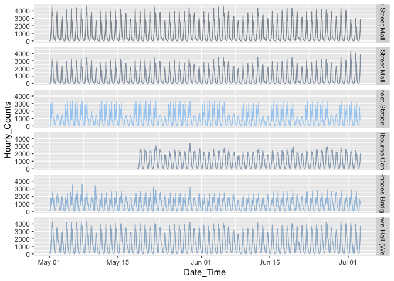

Data is incomplete for some sensors. Possible reasons include maintenance.

``` r
ggplot(data.ts, aes(x=Hourly_Counts)) +
  geom_density(alpha=0.5, fill="red", color=NA)
```

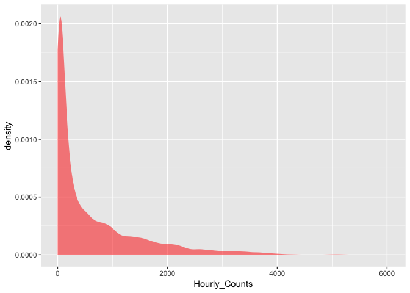

``` r
ggplot(data.ts, aes(x=log(Hourly_Counts+1))) +
  geom_density(alpha=0.5, fill="blue", color=NA)
```

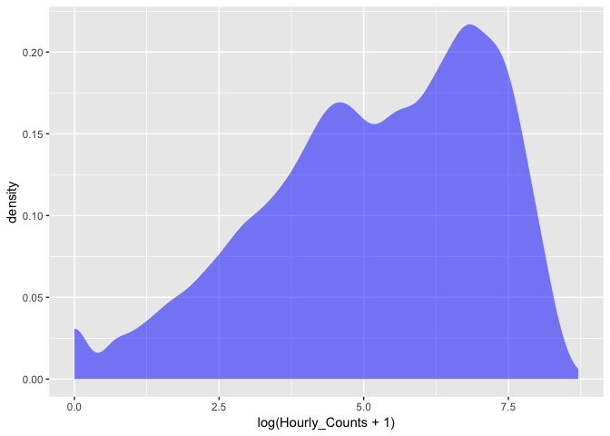

``` r
data.ts2 <- data.ts %>%
  select(Date_Time, Sensor_Name, Hourly_Counts) %>%
  spread(key=Sensor_Name, value=Hourly_Counts) %>%
  select(-Date_Time) %>%
  as.ts %>%
  na.contiguous # analysis does not include missing data
  # stcenter# %>%

ggcorrplot(cor(data.ts2[,1:16]), show.legend=F, type="lower", lab=T, lab_size=1.5)
```

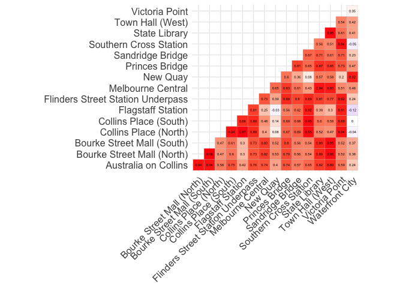

Spatial correlations have varying levels -- factors other than time of day/year lead to correlation.

Experiment with models
----------------------

Fit a simple time series without any cross-correlation

``` r
result <- lapply(data.ts2, function(x) forecast(auto.arima(x)))
plot(result[[1]])
```

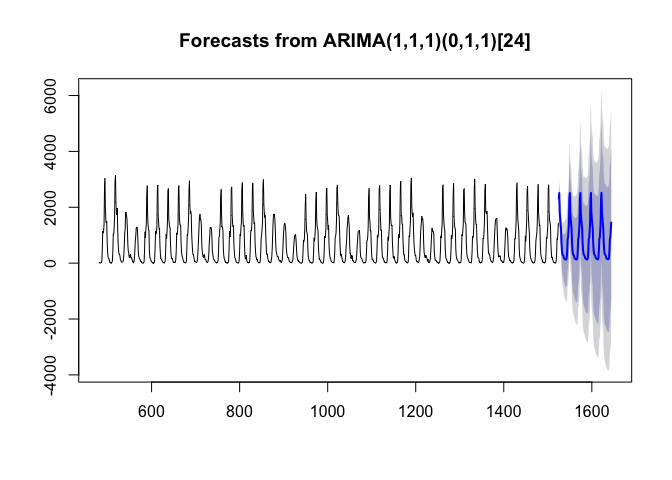

lagsarlm (Spatial Simultaneous Autoregressive Lag Model Estimation)
-------------------------------------------------------------------

lagsarlm is for spatial effects and does not help with time series.

SpatioTemporal
--------------

Multiple ARIMA
--------------

MARIMA requires connectivity between observation nodes to be specified. The data contains 58 sensors, but only 18 geographic locations are available with multiple sensors per location. Sensors have to be manually assigned a coordinate.

``` r
# marima.result = marima(data.ts2, ar.pattern=2)
```

Ignore this: example from website

``` r
# Create a 5x5 regular grid which will be our lattice
sites <- matrix(0, 25, 2)
for (i in 1:5) {
    for (j in 1:5)
        sites[(i-1)*5 + j, ] <- c(i, j) - .5
}
plot(sites)
```

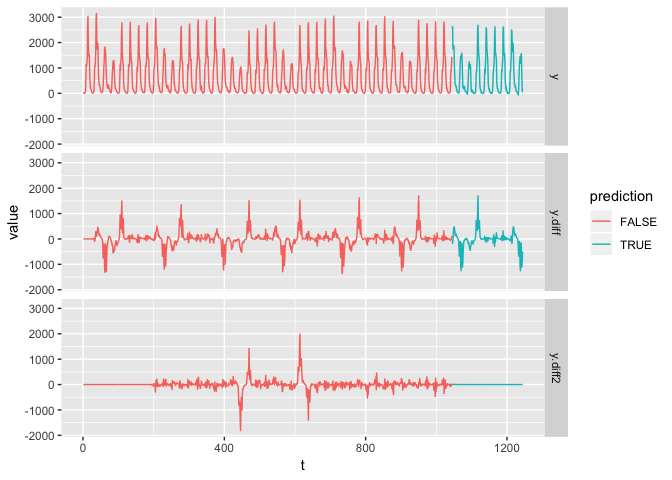

``` r
# Create a uniform first order neighbourhood
knb <- dnearneigh(sites, 0, 1)
plot(knb, sites)
```

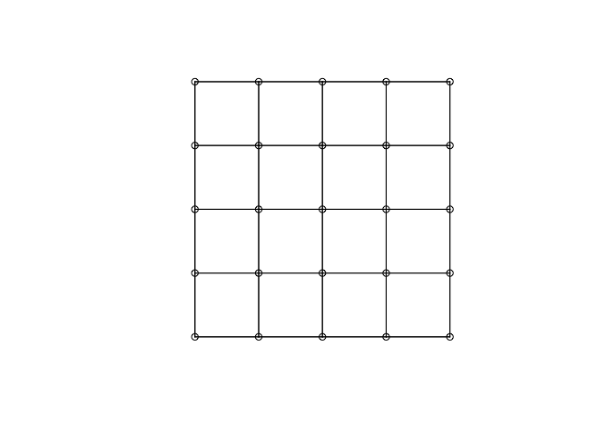

``` r
# Lag the neighbourhood to create other order matrices
knb <- nblag(knb, 4)
klist <- list(order0=diag(25),
           order1=nb2mat(knb[[1]]),
           order2=nb2mat(knb[[2]]),
           order3=nb2mat(knb[[3]]),
           order4=nb2mat(knb[[4]]))
           
# Simulate a STARMA(2;1) process
eps <- matrix(rnorm(200*25), 200, 25)
star <- eps
for (t in 3:200) {
    star[t,] <- (.4*klist[[1]] + .25*klist[[2]]) %*% star[t-1,] + 
      (.25*klist[[1]]) %*% star[t-2,] + (-.3*klist[[2]]) %*% eps[t-1,] + 
      eps[t, ]
}

star <- star[101:200,]  # Remove first observations
star <- stcenter(star)  # Center and scale the dataset
                                           
# Identify the process
stacf(star, klist)
```

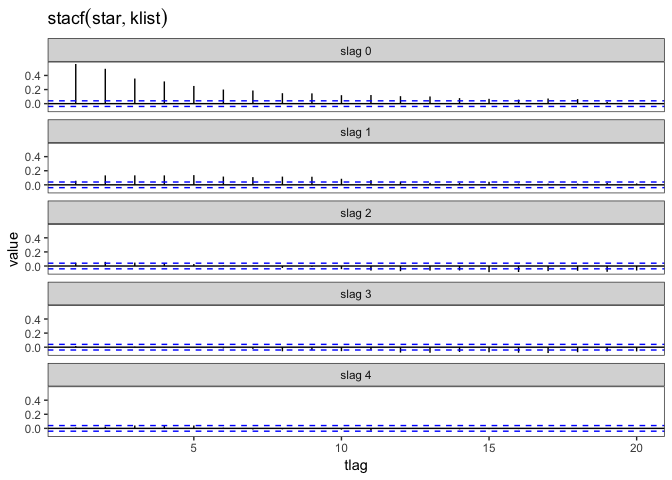

``` r
stpacf(star, klist)
```

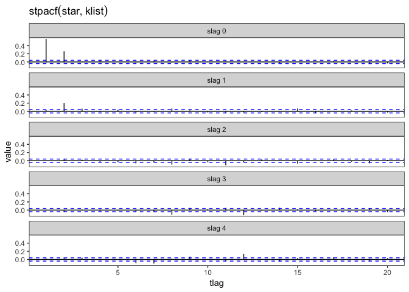

``` r
# Estimate the process
ar <- matrix(c(1, 1, 1, 0), 2, 2)
ma <- matrix(c(0, 1), 1, 2)
model <- starma(star, klist, ar, ma)
model
```

    ## Call:
    ## starma.default(data = star, wlist = klist, ar = ar, ma = ma)
    ## ---------------------------------------------------------------
    ## 
    ## AR parameters:
    ##         slag 0 slag 1
    ## tlag 1 0.40228 0.2139
    ## tlag 2 0.25899     NA
    ## 
    ## Standard deviation:
    ##          slag 0 slag 1
    ## tlag 1 0.019533 0.0415
    ## tlag 2 0.019436     NA
    ## ---------------------------------------------------------------
    ## 
    ## MA parameters:
    ##        slag 0  slag 1
    ## tlag 1     NA -0.3183
    ## 
    ## Standard deviation:
    ##        slag 0 slag 1
    ## tlag 1     NA 0.0533
    ## ---------------------------------------------------------------
    ## 
    ## sigma2 estimated as 0.6379652:  log likelihood = -2975.442  bic = 5982.179

``` r
summary(model)
```

    ## Call:
    ## starma.default(data = star, wlist = klist, ar = ar, ma = ma)
    ## 
    ##          Estimate Std..Error t.value   p.value    
    ## phi10    0.402279   0.019533 20.5952 < 2.2e-16 ***
    ## phi11    0.213934   0.041535  5.1507 2.799e-07 ***
    ## phi20    0.258987   0.019436 13.3254 < 2.2e-16 ***
    ## theta11 -0.318287   0.053269 -5.9751 2.627e-09 ***
    ## ---
    ## Signif. codes:  0 '***' 0.001 '**' 0.01 '*' 0.05 '.' 0.1 ' ' 1

``` r
# Diagnose the process
stcor.test(model$residuals, klist, fitdf=4)
```

    ##  Multivariate Box-Pierce Non Correlation Test
    ##  --------------------------------------------
    ## 
    ##   X.squared df    p.value
    ## 1   114.703 96 0.09370156
    ## 
    ## Decision: Can't reject Non Correlation Hypothesis.

``` r
stacf(model$residuals, klist)
```

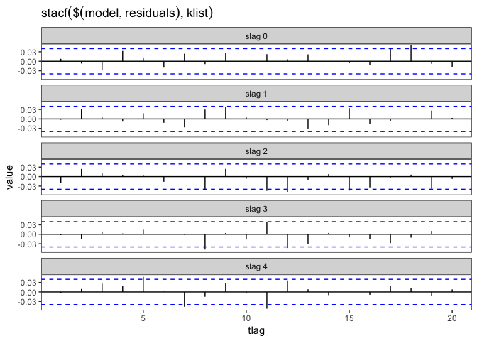

``` r
stpacf(model$residuals, klist)
```

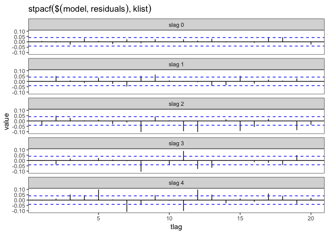

``` r
# starma(matrix.ts, c(diag(18)), ar=0, ma=0)
```

Process geographic data
-----------------------

``` r
data.geo = raw.geo %>%
  mutate(Latitude = as.numeric(Latitude),
         Longitude = as.numeric(Longitude)) %>%
  # st_as_sf(coords=c("Latitude", "Longitude")) %>%
  select(-Status, -Upload.Date, -Geometry, -Location.Type)

leaflet() %>%
  addProviderTiles(providers$CartoDB.Positron) %>%
  addCircleMarkers(data.geo$Longitude, data.geo$Latitude,
                   label=data.geo$Sensor.Description,
                   weight=0, radius=4, fillOpacity=0.5)
```

    ## PhantomJS not found. You can install it with webshot::install_phantomjs(). If it is installed, please make sure the phantomjs executable can be found via the PATH variable.

<!--html_preserve-->

<script type="application/json" data-for="htmlwidget-c91efca9130e37d17736">{"x":{"options":{"crs":{"crsClass":"L.CRS.EPSG3857","code":null,"proj4def":null,"projectedBounds":null,"options":{}}},"calls":[{"method":"addProviderTiles","args":["CartoDB.Positron",null,null,{"errorTileUrl":"","noWrap":false,"detectRetina":false}]},{"method":"addCircleMarkers","args":[[-37.8110152342489,-37.8123967869915,-37.8134486106919,-37.8240177591352,-37.8168607425204,-37.8138066724228,-37.811729134669,-37.8187647327542,-37.8073006699971,-37.8031027095484,-37.8124470265268,-37.8099934057793,-37.8201782771032,-37.806068879192,-37.806315806617,-37.8188796214196,-37.8136254240211,-37.8106437830727,-37.7969047300547,-37.8153798501116,-37.8040239999553,-37.8187424894411,-37.8123720170999,-37.8137974851005,-37.8166863320591,-37.8201124166947,-37.8125215691035,-37.8116033115848,-37.8016968046535,-37.8000856548236,-37.8191170445268,-37.8100617233511,-37.8086954214778,-37.817673499533,-37.8157374166874,-37.8212992424763,-37.8148325157834,-37.8190925593958,-37.8172343724998,-37.8141407401773,-37.7980819129784,-37.8183237506589,-37.819658083823,-37.8156418999105,-37.8084181419925,-37.8156498888822,-37.8123477497748,-37.8165252682678,-37.8178644478193,-37.8157342252752,-37.8229354263742,-37.8024071877061,-37.7984452524968,-37.8134944036338,-37.8198299169874,-37.8112184919515,-37.8148798759503,-37.8145798719868],[144.964294851728,144.956526528442,144.973053538633,144.956044263919,144.95358075251,144.965167185971,144.968246601442,144.947105451213,144.959560550793,144.966714517396,144.967787571661,144.972275879457,144.965088773616,144.956446929732,144.958666979097,144.95449198131,144.973235916778,144.964471322694,144.964403781053,144.974150495806,144.963083999809,144.967876562712,144.965506710649,144.969957454141,144.966897334535,144.96291897546,144.961940101874,144.962200774628,144.966589114895,144.963864121768,144.965582558609,144.96142334572,144.960494038903,144.950255946636,144.966857177706,144.968793093492,144.974540556573,144.954527490176,144.967150328493,144.9660937975,144.967210138302,144.971414820121,144.968634533137,144.965499000498,144.959063166657,144.939706947708,144.961533113969,144.961210625343,144.965068228214,144.965210438559,144.947175106953,144.961567307798,144.964117822271,144.965153237914,144.951025557542,144.966568066001,144.966087801437,144.942923981029],4,null,null,{"interactive":true,"className":"","stroke":true,"color":"#03F","weight":0,"opacity":0.5,"fill":true,"fillColor":"#03F","fillOpacity":0.5},null,null,null,null,["Melbourne Central","Flagstaff Station","Collins Place (North)","Melbourne Convention Exhibition Centre","Bourke St - Spencer St (North)","Bourke Street Mall (South)","Chinatown-Lt Bourke St (South)","Victoria Point","QVM-Therry St (South)","Lygon St (East)","Bourke St-Russell St (West)","Lonsdale St-Spring St (West)","Southbank","QV Market-Peel St","QVM-Queen St (East)","Spencer St-Collins St (North)","Collins Place (South)","State Library","Tin Alley-Swanston St (West)","Flinders St-Spark La","Lincoln-Swanston (West)","Princes Bridge","Chinatown-Swanston St (North)","Alfred Place","Flinders La-Swanston St (West)","Sandridge Bridge","Elizabeth St-Lonsdale St (South)","Melbourne Central-Elizabeth St (East)Melbourne Central-Elizabeth St (East)","Lygon St (West)","Grattan St-Swanston St (West)","Flinders Street Station Underpass","Elizabeth St-La Trobe St (East)","QV Market-Elizabeth St (West)","Bourke St Bridge","City Square","The Arts Centre","Flinders St-Spring St (West)","Spencer St-Collins St (South)","Flinders St-Swanston St (West)","Little Collins St-Swanston St (East)","Faraday St-Lygon St (West)","Birrarung Marr","St Kilda Rd-Alexandra Gardens","Collins Street (North)","QVM-Franklin St (North)","Waterfront City","Lonsdale St - Elizabeth St (North)","Queen St (West)","Flinders St-Elizabeth St (East)","Australia on Collins","Webb Bridge","Pelham St (South)","Monash Rd-Swanston St (West)","Bourke Street Mall (North)","Southern Cross Station","Lonsdale St (South)","Town Hall (West)","New Quay"],{"interactive":false,"permanent":false,"direction":"auto","opacity":1,"offset":[0,0],"textsize":"10px","textOnly":false,"className":"","sticky":true},null]}],"limits":{"lat":[-37.8240177591352,-37.7969047300547],"lng":[144.939706947708,144.974540556573]}},"evals":[],"jsHooks":[]}</script>
<!--/html_preserve-->
Estimate neighborhoods based on the example
-------------------------------------------

``` r
sites = data.geo %>% select(Latitude, Longitude) %>% as.matrix
knb <- dnearneigh(sites, 0, 0.006)
plot(knb, sites)
```

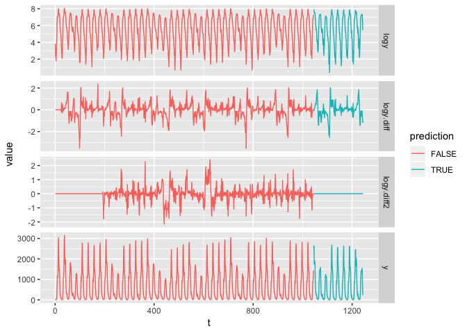

``` r
# Lag the neighbourhood to create other order matrices
knb <- nblag(knb, 3)
klist <- list(order0=diag(58),
           order1=nb2mat(knb[[1]]),
           order2=nb2mat(knb[[2]]),
           order3=nb2mat(knb[[3]]))

# Identify the process
stacf(data.ts2, klist)
stpacf(data.ts2, klist)
```
