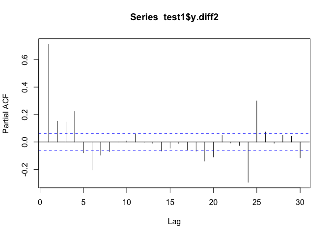

Exploratory Data Analysis
================
Logan Wu
7 January 2019

Load data
---------

``` r
# read in a manageable portion of the dataset for now
raw.ts <- fread("data/Pedestrian_volume__updated_monthly_.csv", nrows=25000)
raw.ts[,Date_Time := as.POSIXct(Date_Time, format="%m/%d/%Y %I:%M:%S %p")]

raw.geo <- read.csv("data/Pedestrian_sensor_locations.csv")
```

Process TS data
---------------

``` r
data.ts = raw.ts %>%
  select(-ID)

ggplot(data.ts %>% filter(Sensor_ID %in% seq(6)), aes(x=Date_Time, y=Hourly_Counts, color=Sensor_ID)) +
  geom_line(alpha=0.5) +
  facet_grid(Sensor_Name~.) +
  guides(color=F)
```


Data is incomplete for some sensors. Possible reasons include maintenance.

``` r
ggplot(data.ts, aes(x=Hourly_Counts)) +
  geom_density(alpha=0.5, fill="red", color=NA)
```


``` r
ggplot(data.ts, aes(x=log(Hourly_Counts+1))) +
  geom_density(alpha=0.5, fill="blue", color=NA)
```


``` r
data.ts2 <- data.ts %>%
  select(Date_Time, Sensor_Name, Hourly_Counts) %>%
  spread(key=Sensor_Name, value=Hourly_Counts) %>%
  select(-Date_Time) %>%
  as.ts %>%
  na.contiguous # analysis does not include missing data
  # stcenter# %>%

ggcorrplot(cor(data.ts2[,1:16]), show.legend=F, type="lower", lab=T, lab_size=1.5)
```


Spatial correlations have varying levels -- factors other than time of day/year lead to correlation.

Experiment with models
----------------------

Fit a simple time series without any cross-correlation

``` r
# arima.result = auto.arima(data.ts2[,1])
arima.result = arima(data.ts2[,1], order=c(1,1,1),
                     seasonal=list(order=c(0,1,1), period=24))
# result <- lapply(data.ts2, function(x) forecast(auto.arima(x), h=120))
# plot(result[[1]])
plot(forecast(arima.result, h=120))
```


Packages for spatio-temporal regression
=======================================

lagsarlm (Spatial Simultaneous Autoregressive Lag Model Estimation)
-------------------------------------------------------------------

lagsarlm is for spatial effects and does not help with time series.

SpatioTemporal
--------------

Tutorial script is in 02\_spTimer.Rmd

Multiple ARIMA
--------------

MARIMA requires connectivity between observation nodes to be specified. The data contains 58 sensors, but only 18 geographic locations are available with multiple sensors per location. Sensors have to be manually assigned a coordinate.

Seasonal differencing
=====================

The data contains both daily and weekly seasonality. Some R functions, e.g. arima, do not handle multiple seasonalities. We can pre-process to remove the known seasonalities.

``` r
test1 = data.frame(y=data.ts2[,1]) %>%
  mutate(t = row_number(),
         y.diff = y - lag(y, 24),
         y.diff2 = y.diff - lag(y.diff, 168))
test = test1 %>%
  gather(key="key", value="value", -t)

ggplot(test, aes(x=t, y=value, color=key)) +
  geom_line()
```

    ## Don't know how to automatically pick scale for object of type ts. Defaulting to continuous.

    ## Warning: Removed 216 rows containing missing values (geom_path).


The final differenced data is mostly stationary. Spikes could be due to public holidays, which will be ignored for now. Intuitively, we also need at least a first differencing (AR1) but this can be done in the ARIMA fit.

``` r
result = auto.arima(test1$y.diff2)
result.forecast = forecast(result, h=200)$mean
y.diff2 = c(test1$y.diff2, result.forecast)
y.diff2[is.na(y.diff2)] = 0

y.diff = as.numeric(test1$y.diff)
y.diff[is.na(y.diff)] = 0
for (i in (24+169):length(y.diff2)) {
  y.diff[i] = y.diff[i-168] + y.diff2[i]
}
y = as.numeric(test1$y)
for (i in 25:length(y.diff)) {
  y[i] = y[i-24] + y.diff[i]
}

seasonal.result = data.frame(y, y.diff, y.diff2) %>%
  mutate(t=row_number(),
         prediction=t>nrow(test1)) %>%
  gather(key="key", value="value", -t, -prediction)
ggplot(seasonal.result, aes(x=t, y=value, color=prediction)) +
  geom_line() +
  facet_grid(key~.)
```


auto.arima has fit an ARIMA(5,0,0) model.

One issue is that pedestrian counts should be non-negative whereas ARIMA models are unbounded (although no issues are seen in this example). Perhaps a transformation will help.

``` r
pacf(test1$y, lag.max=200)
```


``` r
pacf(test1$y.diff, lag.max=200, na.action=na.pass)
```


``` r
pacf(test1$y.diff2, na.action=na.pass)
```



Despite differencing, there remains a large partial autocorrelation with 24 hours. However, an AR(1) model is probably still the most appropriate on the differenced data.

``` r
# experiment on logged series
# offset of 1 to keep log supported
test2 = data.frame(logy=log(data.ts2[,1]+1)) %>%
  mutate(t = row_number(),
         logy.diff = logy - lag(logy, 24),
         logy.diff2 = logy.diff - lag(logy.diff, 168))
test = test1 %>%
  gather(key="key", value="value", -t)

result = auto.arima(test2$logy.diff2)
result.forecast = forecast(result, h=200)$mean
logy.diff2 = c(test2$logy.diff2, result.forecast)
logy.diff2[is.na(logy.diff2)] = 0

logy.diff = as.numeric(test2$logy.diff)
logy.diff[is.na(logy.diff)] = 0
for (i in (24+169):length(logy.diff2)) {
  logy.diff[i] = logy.diff[i-168] + logy.diff2[i]
}
logy = as.numeric(test2$logy)
for (i in 25:length(logy.diff)) {
  logy[i] = logy[i-24] + logy.diff[i]
}

seasonal.result = data.frame(logy, logy.diff, logy.diff2) %>%
  mutate(y=exp(logy)-1,
         t=row_number(),
         prediction=t>nrow(test2)) %>%
  gather(key="key", value="value", -t, -prediction)
ggplot(seasonal.result, aes(x=t, y=value, color=prediction)) +
  geom_line() +
  facet_grid(key~., scales="free_y")
```


The final series looks correct.

Issue: No confidence intervals. A Bayesian approach may be required.

Ignore below: example from website

``` r
# Create a 5x5 regular grid which will be our lattice
sites <- matrix(0, 25, 2)
for (i in 1:5) {
    for (j in 1:5)
        sites[(i-1)*5 + j, ] <- c(i, j) - .5
}
plot(sites)
```


``` r
# Create a uniform first order neighbourhood
knb <- dnearneigh(sites, 0, 1)
plot(knb, sites)
```


``` r
# Lag the neighbourhood to create other order matrices
knb <- nblag(knb, 4)
klist <- list(order0=diag(25),
           order1=nb2mat(knb[[1]]),
           order2=nb2mat(knb[[2]]),
           order3=nb2mat(knb[[3]]),
           order4=nb2mat(knb[[4]]))
           
# Simulate a STARMA(2;1) process
eps <- matrix(rnorm(200*25), 200, 25)
star <- eps
for (t in 3:200) {
    star[t,] <- (.4*klist[[1]] + .25*klist[[2]]) %*% star[t-1,] + 
      (.25*klist[[1]]) %*% star[t-2,] + (-.3*klist[[2]]) %*% eps[t-1,] + 
      eps[t, ]
}

star <- star[101:200,]  # Remove first observations
star <- stcenter(star)  # Center and scale the dataset
                                           
# Identify the process
stacf(star, klist)
```


``` r
stpacf(star, klist)
```


``` r
# Estimate the process
ar <- matrix(c(1, 1, 1, 0), 2, 2)
ma <- matrix(c(0, 1), 1, 2)
model <- starma(star, klist, ar, ma)
model
```

    ## Call:
    ## starma.default(data = star, wlist = klist, ar = ar, ma = ma)
    ## ---------------------------------------------------------------
    ## 
    ## AR parameters:
    ##         slag 0 slag 1
    ## tlag 1 0.40228 0.2139
    ## tlag 2 0.25899     NA
    ## 
    ## Standard deviation:
    ##          slag 0 slag 1
    ## tlag 1 0.019533 0.0415
    ## tlag 2 0.019436     NA
    ## ---------------------------------------------------------------
    ## 
    ## MA parameters:
    ##        slag 0  slag 1
    ## tlag 1     NA -0.3183
    ## 
    ## Standard deviation:
    ##        slag 0 slag 1
    ## tlag 1     NA 0.0533
    ## ---------------------------------------------------------------
    ## 
    ## sigma2 estimated as 0.6379652:  log likelihood = -2975.442  bic = 5982.179

``` r
summary(model)
```

    ## Call:
    ## starma.default(data = star, wlist = klist, ar = ar, ma = ma)
    ## 
    ##          Estimate Std..Error t.value   p.value    
    ## phi10    0.402279   0.019533 20.5952 < 2.2e-16 ***
    ## phi11    0.213934   0.041535  5.1507 2.799e-07 ***
    ## phi20    0.258987   0.019436 13.3254 < 2.2e-16 ***
    ## theta11 -0.318287   0.053269 -5.9751 2.627e-09 ***
    ## ---
    ## Signif. codes:  0 '***' 0.001 '**' 0.01 '*' 0.05 '.' 0.1 ' ' 1

``` r
# Diagnose the process
stcor.test(model$residuals, klist, fitdf=4)
```

    ##  Multivariate Box-Pierce Non Correlation Test
    ##  --------------------------------------------
    ## 
    ##   X.squared df    p.value
    ## 1   114.703 96 0.09370156
    ## 
    ## Decision: Can't reject Non Correlation Hypothesis.

``` r
stacf(model$residuals, klist)
```


``` r
stpacf(model$residuals, klist)
```


Process geographic data
-----------------------

``` r
data.geo = raw.geo %>%
  mutate(Latitude = as.numeric(Latitude),
         Longitude = as.numeric(Longitude)) %>%
  # st_as_sf(coords=c("Latitude", "Longitude")) %>%
  select(-Status, -Upload.Date, -Geometry, -Location.Type)

# leaflet() %>%
#   addProviderTiles(providers$CartoDB.Positron) %>%
#   addCircleMarkers(data.geo$Longitude, data.geo$Latitude,
#                    label=data.geo$Sensor.Description,
#                    weight=0, radius=4, fillOpacity=0.5)
```

Estimate neighborhoods based on the example
-------------------------------------------

``` r
sites = data.geo %>% 
  select(Sensor.Description, Latitude, Longitude) %>%
  filter(Sensor.Description %in% colnames(data.ts2)) %>%
  st_as_sf(coords = c("Longitude", "Latitude")) %>%
  filter(Sensor.Description %in% colnames(data.ts2)) %>%
  arrange(Sensor.Description)
  
# knb <- dnearneigh(as_Spatial(sites), 0, 0.01)
knb <- knearneigh(as_Spatial(sites), 5) %>% knn2nb
plot(knb, st_coordinates(sites))
```


``` r
# Lag the neighbourhood to create other order matrices
knb <- nblag(knb, 3)
klist <- list(order0=diag(17),
           order1=nb2mat(knb[[1]]),
           order2=nb2mat(knb[[2]]))

# Identify the process
stacf(data.ts2, klist)
```


``` r
stpacf(data.ts2, klist)
```


``` r
# Estimate the process
ar <- matrix(c(1, 1, 1, 0), 2, 2)
ma <- matrix(c(0, 1), 1, 2)
model <- starma(data.ts2, klist, ar, ma)
model
```

    ## Call:
    ## starma.default(data = data.ts2, wlist = klist, ar = ar, ma = ma)
    ## ---------------------------------------------------------------
    ## 
    ## AR parameters:
    ##          slag 0 slag 1
    ## tlag 1  0.99404 0.0854
    ## tlag 2 -0.17820     NA
    ## 
    ## Standard deviation:
    ##          slag 0 slag 1
    ## tlag 1 0.011018 0.0063
    ## tlag 2 0.010950     NA
    ## ---------------------------------------------------------------
    ## 
    ## MA parameters:
    ##        slag 0 slag 1
    ## tlag 1     NA 0.1976
    ## 
    ## Standard deviation:
    ##        slag 0 slag 1
    ## tlag 1     NA 0.0156
    ## ---------------------------------------------------------------
    ## 
    ## sigma2 estimated as 206060.7:  log likelihood = -131013.6  bic = 262066.4

``` r
summary(model)
```

    ## Call:
    ## starma.default(data = data.ts2, wlist = klist, ar = ar, ma = ma)
    ## 
    ##           Estimate Std..Error t.value   p.value    
    ## phi10    0.9940388  0.0110175  90.224 < 2.2e-16 ***
    ## phi11    0.0853701  0.0063019  13.547 < 2.2e-16 ***
    ## phi20   -0.1782023  0.0109505 -16.273 < 2.2e-16 ***
    ## theta11  0.1975636  0.0156109  12.655 < 2.2e-16 ***
    ## ---
    ## Signif. codes:  0 '***' 0.001 '**' 0.01 '*' 0.05 '.' 0.1 ' ' 1

``` r
# star <- star[101:200,]    # Remove first observations
# star <- stcenter(star)    # Center and scale the dataset

# Diagnose the process
stcor.test(model$residuals, klist, fitdf=4)
```

    ##  Multivariate Box-Pierce Non Correlation Test
    ##  --------------------------------------------
    ## 
    ##   X.squared df p.value
    ## 1  37160.23 86       0
    ## 
    ## Decision: Non Correlation Hypothesis should be rejected.

``` r
stacf(model$residuals, klist)
```


``` r
stpacf(model$residuals, klist)
```


We are interested in the partial autocorrelation - the dependence on a certain term given the other correlations (note: check this). They are generally weak.
