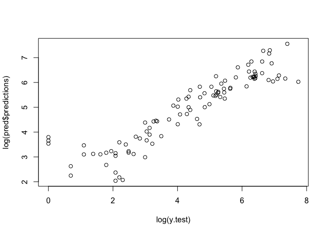
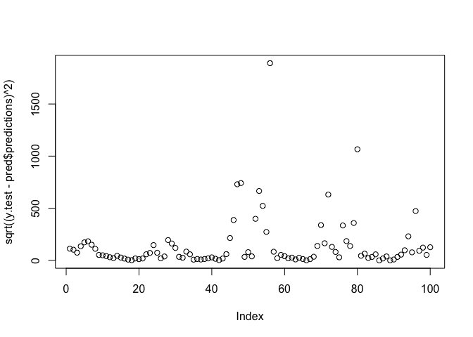
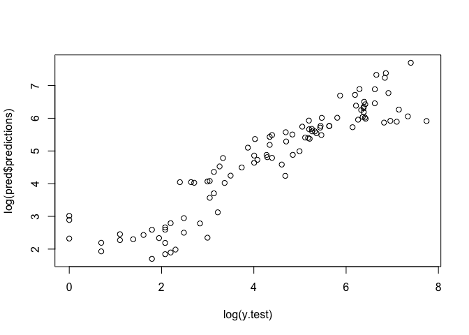
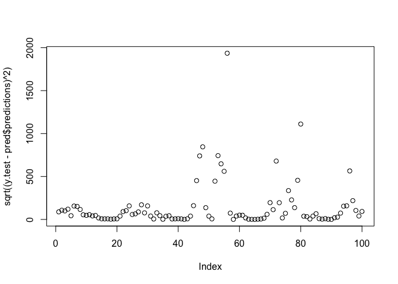
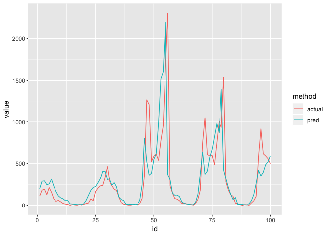

Black Box Methods
================
Logan Wu
1/8/2019

Load data
---------

``` r
# read in a manageable portion of the dataset for now
raw.ts <- fread("data/Pedestrian_volume__updated_monthly_.csv", nrows=100000)
raw.ts[,Date_Time := as.POSIXct(Date_Time, format="%m/%d/%Y %I:%M:%S %p")]
```

Process data
------------

``` r
data.ts = raw.ts %>%
  select(-ID) %>%
  select(Date_Time, Sensor_Name, Hourly_Counts, Time, Day) %>%
  spread(key=Sensor_Name, value=Hourly_Counts) %>%
  select(-Date_Time) %>%
  mutate(Day = factor(Day)) %>%
  as.ts %>%
  na.contiguous %>% # analysis does not include missing data
  as.data.frame
```

    ## Warning: package 'bindrcpp' was built under R version 3.4.4

``` r
data.ts = data.ts[,1:4]
# data.lag = data.ts

lags = list()
for (i in 1:3) {
  lags[[i]] = data.ts %>% select(-Time, -Day) %>% mutate_all(function (x) lead(x, i)) %>%
  rename_all(function(x) paste0(x,".lag", i))
}
lags = do.call(cbind, lags)

# append the lags onto each current measurement
X = list()
for (i in 1:(ncol(data.ts)-2)) {
  X[[i]] = cbind(Hourly_Counts=data.ts[,i+2], Day=data.ts[,2], Time=data.ts[,1], Sensor_Name=names(data.ts)[i+2], lags)
}
X = do.call(rbind, X) %>%
  drop_na()
X %>% head
```

    ##   Hourly_Counts Day Time          Sensor_Name Australia on Collins.lag1
    ## 1            83   1    0 Australia on Collins                        35
    ## 2            35   1    1 Australia on Collins                        14
    ## 3            14   1    2 Australia on Collins                        12
    ## 4            12   1    3 Australia on Collins                         8
    ## 5             8   1    4 Australia on Collins                        23
    ## 6            23   1    5 Australia on Collins                        89
    ##   Birrarung Marr.lag1 Australia on Collins.lag2 Birrarung Marr.lag2
    ## 1                   8                        14                   7
    ## 2                   7                        12                  19
    ## 3                  19                         8                   9
    ## 4                   9                        23                   8
    ## 5                   8                        89                  90
    ## 6                  90                       373                 236
    ##   Australia on Collins.lag3 Birrarung Marr.lag3
    ## 1                        12                  19
    ## 2                         8                   9
    ## 3                        23                   8
    ## 4                        89                  90
    ## 5                       373                 236
    ## 6                       980                 253

Test RF
-------

``` r
library(ranger)
```

    ## Warning: package 'ranger' was built under R version 3.4.4

``` r
names(X) = make.names(names(X))
n.test = 100
X.train = X %>% head(nrow(X) - n.test)
X.test = X %>% tail(n.test)
y.test = X.test %>% pull(Hourly_Counts)


rf <- ranger(Hourly_Counts ~ . -Time -Day, data=X.train)
pred <- predict(rf, X.test)
plot(log(y.test), log(pred$predictions))
```



``` r
plot(sqrt((y.test-pred$predictions)^2))
```



``` r
print(sum(sqrt((y.test-pred$predictions)^2)))
```

    ## [1] 14206.97

``` r
rf <- ranger(Hourly_Counts ~ ., data=X.train)
pred <- predict(rf, X.test)
plot(log(y.test), log(pred$predictions))
```



``` r
plot(sqrt((y.test-pred$predictions)^2))
```



``` r
print(sum(sqrt((y.test-pred$predictions)^2)))
```

    ## [1] 14724.11

``` r
plt.df = data.frame(actual=y.test, pred=pred$predictions) %>%
  mutate(id = row_number()) %>%
  gather(key="method", value="value", -id)
ggplot(plt.df, aes(x=id, y=value, color=method)) +
  geom_line()
```



Early indications are good. Comparison required against univariate TS is needed.
