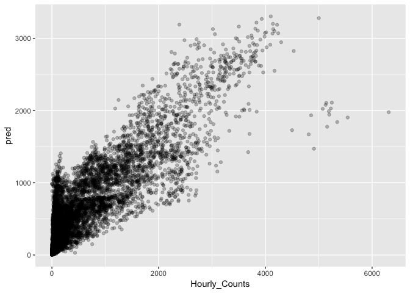

Black Box Methods
================
Logan Wu
1/8/2019

Load data
---------

``` r
# read in a manageable portion of the dataset for now
raw.ts <- fread("data/Pedestrian_volume__updated_monthly_.csv", nrows=50000)
raw.ts[,Date_Time := as.POSIXct(Date_Time, format="%m/%d/%Y %I:%M:%S %p")]
```

Process data
------------

Feature vector includes:

-   n hours of lags
-   Time of day
-   Day of week
-   Sensor name or ID

Could include:

-   Month of year, and year (or some other trend term)
-   Public holiday

``` r
metadata = c("Date_Time", "Sensor_Name", "Time", "Day")
nlag = 4

data.ts = raw.ts %>%
  dplyr::select(metadata, Hourly_Counts) %>%
  spread(key=Sensor_Name, value=Hourly_Counts) %>%
  # dplyr::select(-Date_Time) %>%
  mutate(Day = factor(Day)) %>%
  as.ts %>%
  na.contiguous %>% # analysis does not include missing data
  as.data.frame %>%
  mutate(Date_Time=as.POSIXct(Date_Time, origin="1970-01-01"))
```

    ## Warning: package 'bindrcpp' was built under R version 3.4.4

``` r
data.ts = data.ts[,1:12]
nloc = ncol(data.ts) - length(metadata)
locs = setdiff(colnames(data.ts), metadata)
# data.lag = data.ts

lags = list()
for (i in 1:nlag) {
  lags[[i]] = data.ts %>%
    dplyr::select(-one_of(metadata)) %>%
    mutate_all(function (x) lead(x, i)) %>%
    rename_all(function(x) paste0(x,".lag", i))
}
```

    ## Warning: Unknown columns: `Sensor_Name`

    ## Warning: Unknown columns: `Sensor_Name`

    ## Warning: Unknown columns: `Sensor_Name`

    ## Warning: Unknown columns: `Sensor_Name`

``` r
lags = do.call(cbind, lags)

# append the lags onto each current measurement
X = list()
for (j in 1:nloc) {
  X[[j]] = cbind(Hourly_Counts=data.ts[,locs[j]], 
                 Day=data.ts$Day, 
                 Time=data.ts$Time, 
                 Date_Time=data.ts$Date_Time,
                 Sensor_Name=locs[j],
                 lags)
}
X = do.call(rbind, X) %>%
  drop_na() %>%
  arrange(Date_Time)
names(X) = make.names(names(X))
X %>% head %>% kable
```

|  Hourly\_Counts|  Day|  Time| Date\_Time | Sensor\_Name               |  Australia.on.Collins.lag1|  Bourke.Street.Mall..North..lag1|  Bourke.Street.Mall..South..lag1|  Collins.Place..North..lag1|  Collins.Place..South..lag1|  Flagstaff.Station.lag1|  Flinders.Street.Station.Underpass.lag1|  Melbourne.Central.lag1|  New.Quay.lag1|  Australia.on.Collins.lag2|  Bourke.Street.Mall..North..lag2|  Bourke.Street.Mall..South..lag2|  Collins.Place..North..lag2|  Collins.Place..South..lag2|  Flagstaff.Station.lag2|  Flinders.Street.Station.Underpass.lag2|  Melbourne.Central.lag2|  New.Quay.lag2|  Australia.on.Collins.lag3|  Bourke.Street.Mall..North..lag3|  Bourke.Street.Mall..South..lag3|  Collins.Place..North..lag3|  Collins.Place..South..lag3|  Flagstaff.Station.lag3|  Flinders.Street.Station.Underpass.lag3|  Melbourne.Central.lag3|  New.Quay.lag3|  Australia.on.Collins.lag4|  Bourke.Street.Mall..North..lag4|  Bourke.Street.Mall..South..lag4|  Collins.Place..North..lag4|  Collins.Place..South..lag4|  Flagstaff.Station.lag4|  Flinders.Street.Station.Underpass.lag4|  Melbourne.Central.lag4|  New.Quay.lag4|
|---------------:|----:|-----:|:-----------|:---------------------------|--------------------------:|--------------------------------:|--------------------------------:|---------------------------:|---------------------------:|-----------------------:|---------------------------------------:|-----------------------:|--------------:|--------------------------:|--------------------------------:|--------------------------------:|---------------------------:|---------------------------:|-----------------------:|---------------------------------------:|-----------------------:|--------------:|--------------------------:|--------------------------------:|--------------------------------:|---------------------------:|---------------------------:|-----------------------:|---------------------------------------:|-----------------------:|--------------:|--------------------------:|--------------------------------:|--------------------------------:|---------------------------:|---------------------------:|-----------------------:|---------------------------------------:|-----------------------:|--------------:|
|              45|    5|     0| 2009-05-21 | Australia on Collins       |                         10|                               18|                               15|                           8|                          23|                       5|                                      52|                     118|              3|                          8|                                7|                                9|                           3|                           9|                       3|                                      30|                      64|              4|                          5|                               10|                               18|                           1|                          19|                      18|                                      20|                      32|              5|                         11|                               22|                                8|                           1|                          13|                      10|                                      67|                      43|              0|
|              27|    5|     0| 2009-05-21 | Bourke Street Mall (North) |                         10|                               18|                               15|                           8|                          23|                       5|                                      52|                     118|              3|                          8|                                7|                                9|                           3|                           9|                       3|                                      30|                      64|              4|                          5|                               10|                               18|                           1|                          19|                      18|                                      20|                      32|              5|                         11|                               22|                                8|                           1|                          13|                      10|                                      67|                      43|              0|
|              40|    5|     0| 2009-05-21 | Bourke Street Mall (South) |                         10|                               18|                               15|                           8|                          23|                       5|                                      52|                     118|              3|                          8|                                7|                                9|                           3|                           9|                       3|                                      30|                      64|              4|                          5|                               10|                               18|                           1|                          19|                      18|                                      20|                      32|              5|                         11|                               22|                                8|                           1|                          13|                      10|                                      67|                      43|              0|
|               8|    5|     0| 2009-05-21 | Collins Place (North)      |                         10|                               18|                               15|                           8|                          23|                       5|                                      52|                     118|              3|                          8|                                7|                                9|                           3|                           9|                       3|                                      30|                      64|              4|                          5|                               10|                               18|                           1|                          19|                      18|                                      20|                      32|              5|                         11|                               22|                                8|                           1|                          13|                      10|                                      67|                      43|              0|
|              39|    5|     0| 2009-05-21 | Collins Place (South)      |                         10|                               18|                               15|                           8|                          23|                       5|                                      52|                     118|              3|                          8|                                7|                                9|                           3|                           9|                       3|                                      30|                      64|              4|                          5|                               10|                               18|                           1|                          19|                      18|                                      20|                      32|              5|                         11|                               22|                                8|                           1|                          13|                      10|                                      67|                      43|              0|
|              10|    5|     0| 2009-05-21 | Flagstaff Station          |                         10|                               18|                               15|                           8|                          23|                       5|                                      52|                     118|              3|                          8|                                7|                                9|                           3|                           9|                       3|                                      30|                      64|              4|                          5|                               10|                               18|                           1|                          19|                      18|                                      20|                      32|              5|                         11|                               22|                                8|                           1|                          13|                      10|                                      67|                      43|              0|

Test RF on train/test split
---------------------------

``` r
frac=0.8
X.train = head(X, round(nrow(X)*frac))
X.test = tail(X, round(nrow(X)*(1-frac)))
y.test = X.test %>% pull(Hourly_Counts)
```

Exclude the time and weekday from the model. Purely regressed on lags from the past three hours.

``` r
rf <- ranger(Hourly_Counts ~ . -Time -Day -Date_Time, data=X.train)
```

    ## Growing trees.. Progress: 92%. Estimated remaining time: 2 seconds.

``` r
pred <- predict(rf, X.test)
X.test$pred = pred$predictions
plot(y.test, pred$predictions)
```


``` r
plot(log(y.test), log(pred$predictions))
```


``` r
cat("RMSE", sqrt(mean((y.test-pred$predictions)^2)))
```

    ## RMSE 277.2216

``` r
cat("MAE", mean(abs(y.test-pred$predictions)))
```

    ## MAE 160.272

``` r
plt.df.train = X.train %>%
  dplyr::select(time=Date_Time, location=Sensor_Name, train=Hourly_Counts) %>%
  gather(key="key", value="value", -time, -location)
plt.df.test = X.test %>%
  dplyr::select(time=Date_Time, location=Sensor_Name, obs=Hourly_Counts, fcst=pred) %>%
  gather(key="key", value="value", -time, -location)
plt.df = rbind(plt.df.train, plt.df.test)

ggplot(plt.df %>% filter(location %in% levels(plt.df$location)[1:6]),
       aes(x=time, y=value, color=key)) +
  geom_line(alpha=0.5) +
  facet_wrap(~location, ncol=1) +
  ylim(0, NA)
```


``` r
# ggplot(X.test, aes(x=Date_Time, y=Hourly_Counts)) +
#   geom_line(color="red") +
#   geom_line(aes(y=pred), color="blue") +
#   geom_line(data=X.train, aes(y=Hourly_Counts)) +
#   facet_wrap(~Sensor_Name, ncol=1)
```

Introduce time and weekday. Would expect it to improve.

``` r
rf2 <- ranger(Hourly_Counts ~ . -Date_Time, data=X.train)
```

    ## Growing trees.. Progress: 89%. Estimated remaining time: 3 seconds.

``` r
pred2 <- predict(rf2, X.test)
X.test$pred2 <- pred2$predictions
plot(y.test, pred2$predictions)
```



``` r
plot(log(y.test), log(pred2$predictions))
```


``` r
cat("RMSE:", sqrt(mean((y.test-pred2$predictions)^2)))
```

    ## RMSE: 290.6063

``` r
cat("MAE", mean(abs(y.test-pred2$predictions)))
```

    ## MAE 167.6095

``` r
ggplot(X.test, aes(x=Date_Time, y=Hourly_Counts)) +
  geom_line(color="red") +
  geom_line(aes(y=pred2), color="blue") +
  geom_line(data=X.train, aes(y=Hourly_Counts)) +
  facet_grid(Sensor_Name~.)
```


Early indications are good but needs proper model comparison. Comparison required against univariate TS is needed. Also needs to incorporate uncertainty.

MAE / model evaluation
----------------------

``` r
MAE = mean(abs(pred$predictions - y.test))
MAE
```

    ## [1] 160.272

Cross-correlation importance
----------------------------

Make separate RFs for each location, and observe the variable importance of cross-correlations.

``` r
Sensor_Names = unique(X$Sensor_Name)
x = list()
rfs = list()
for (s_n in Sensor_Names) {
  x[[s_n]] = X.train %>% filter(Sensor_Name==s_n)
  rfs[[s_n]] = ranger(Hourly_Counts ~ . -Sensor_Name -Date_Time,
                      data=x[[s_n]], importance="permutation")
}
```

``` r
for (s_n in Sensor_Names) {
  g = ggplot(data.frame(importance=importance(rfs[[s_n]])) %>%
           rownames_to_column("variable"),
         aes(x=variable, y=importance, fill=importance)) + 
        geom_bar(stat="identity")+ coord_flip()+
        ylab("Variable Importance")+
        xlab("")+
        ggtitle(paste("Importance for", s_n))+
        guides(fill=F)+
        scale_fill_gradient(low="red", high="blue")
  print(g)
}
```


Permutation feature importance: Determines the marginal impact on performance compared to when one feature is randomised (permuted).

``` r
importance_pvalues(rfs[[1]], "altmann", formula=formula("Hourly_Counts ~ . - Sensor_Name - Date_Time"), data=x[[s_n]], num.permutations=10)
```
