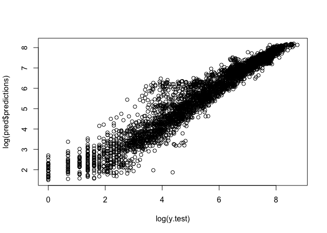
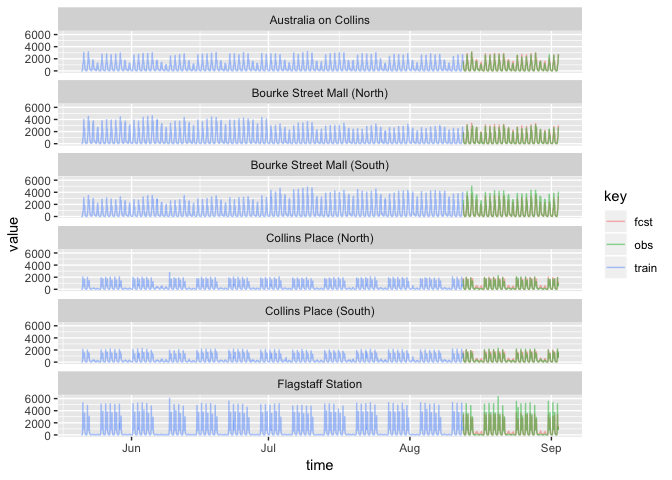

Black Box Methods
================
Logan Wu
1/8/2019

Load data
---------

``` r
# read in a manageable portion of the dataset for now
raw.ts <- fread("data/Pedestrian_volume__updated_monthly_.csv", nrows=20000)
raw.ts[,Date_Time := as.POSIXct(Date_Time, format="%m/%d/%Y %I:%M:%S %p")]
```

Process data
------------

Feature vector includes:

-   n hours of lags
-   Time of day
-   Day of week
-   Sensor name or ID

Could include:

-   Month of year, and year (or some other trend term)
-   Public holiday

``` r
n = 3

data.ts = raw.ts %>%
  dplyr::select(Date_Time, Sensor_Name, Hourly_Counts, Time, Day) %>%
  spread(key=Sensor_Name, value=Hourly_Counts) %>%
  # dplyr::select(-Date_Time) %>%
  mutate(Day = factor(Day)) %>%
  as.ts %>%
  na.contiguous %>% # analysis does not include missing data
  as.data.frame
```

    ## Warning: package 'bindrcpp' was built under R version 3.4.4

``` r
data.ts = data.ts[,1:7]
# data.lag = data.ts

lags = list()
for (i in 1:n) {
  lags[[i]] = data.ts %>% select(-Time, -Day, -Date_Time) %>% mutate_all(function (x) lead(x, i)) %>%
  rename_all(function(x) paste0(x,".lag", i))
}
lags = do.call(cbind, lags)

# append the lags onto each current measurement
X = list()
for (i in 1:(ncol(data.ts)-n+1)) {
  X[[i]] = cbind(Hourly_Counts=data.ts[,i+n-1], Day=data.ts$Day, Time=data.ts$Time, Date_Time=data.ts$Date_Time, Sensor_Name=names(data.ts)[i+n], lags)
}
X = do.call(rbind, X) %>%
  drop_na() %>%
  arrange(Date_Time)
X %>% head
```

    ##   Hourly_Counts Day Time  Date_Time                Sensor_Name
    ## 1             5   5    0 1242828000       Australia on Collins
    ## 2            45   5    0 1242828000 Bourke Street Mall (North)
    ## 3            27   5    0 1242828000 Bourke Street Mall (South)
    ## 4            40   5    0 1242828000      Collins Place (North)
    ## 5             5   5    1 1242831600       Australia on Collins
    ## 6            10   5    1 1242831600 Bourke Street Mall (North)
    ##   Australia on Collins.lag1 Bourke Street Mall (North).lag1
    ## 1                        10                              18
    ## 2                        10                              18
    ## 3                        10                              18
    ## 4                        10                              18
    ## 5                         8                               7
    ## 6                         8                               7
    ##   Bourke Street Mall (South).lag1 Collins Place (North).lag1
    ## 1                              15                          8
    ## 2                              15                          8
    ## 3                              15                          8
    ## 4                              15                          8
    ## 5                               9                          3
    ## 6                               9                          3
    ##   Australia on Collins.lag2 Bourke Street Mall (North).lag2
    ## 1                         8                               7
    ## 2                         8                               7
    ## 3                         8                               7
    ## 4                         8                               7
    ## 5                         5                              10
    ## 6                         5                              10
    ##   Bourke Street Mall (South).lag2 Collins Place (North).lag2
    ## 1                               9                          3
    ## 2                               9                          3
    ## 3                               9                          3
    ## 4                               9                          3
    ## 5                              18                          1
    ## 6                              18                          1
    ##   Australia on Collins.lag3 Bourke Street Mall (North).lag3
    ## 1                         5                              10
    ## 2                         5                              10
    ## 3                         5                              10
    ## 4                         5                              10
    ## 5                        11                              22
    ## 6                        11                              22
    ##   Bourke Street Mall (South).lag3 Collins Place (North).lag3
    ## 1                              18                          1
    ## 2                              18                          1
    ## 3                              18                          1
    ## 4                              18                          1
    ## 5                               8                          1
    ## 6                               8                          1

Test RF
-------

``` r
library(ranger)
```

    ## Warning: package 'ranger' was built under R version 3.4.4

``` r
names(X) = make.names(names(X))
n.test = 500
X.train = X %>% head(nrow(X) - n.test)
X.test = X %>% tail(n.test)
y.test = X.test %>% pull(Hourly_Counts)
```

Exclude the time and weekday. Purely regressed on the past three hours.

``` r
rf <- ranger(Hourly_Counts ~ . -Time -Day -Date_Time, data=X.train, importance="permutation")
pred <- predict(rf, X.test)
X.test$pred = pred$predictions
plot(log(y.test), log(pred$predictions))
```


``` r
plot(sqrt((y.test-pred$predictions)^2))
```



``` r
print(sum(sqrt((y.test-pred$predictions)^2)))
```

    ## [1] 50817.19

``` r
plt.df = data.frame(actual=y.test, pred=pred$predictions) %>%
  mutate(id = row_number()) %>%
  gather(key="method", value="value", -id)
ggplot(plt.df, aes(x=id, y=value, color=method)) +
  geom_line()
```



``` r
ggplot(X.test, aes(x=Date_Time, y=Hourly_Counts)) +
  geom_line(color="red") +
  geom_line(aes(y=pred), color="blue") +
  geom_line(data=X.train, aes(y=Hourly_Counts)) +
  facet_grid(Sensor_Name~.)
```


Introduce time and weekday. Would expect it to improve.

``` r
rf2 <- ranger(Hourly_Counts ~ . -Date_Time, data=X.train, importance="permutation")
pred2 <- predict(rf2, X.test)
X.test$pred2 <- pred2$predictions
plot(log(y.test), log(pred2$predictions))
```


``` r
plot(sqrt((y.test-pred2$predictions)^2), type="l")
```


``` r
print(sum(sqrt((y.test-pred2$predictions)^2)))
```

    ## [1] 54408.37

``` r
ggplot(X.test, aes(x=Date_Time, y=Hourly_Counts)) +
  geom_line(color="red") +
  geom_line(aes(y=pred2), color="blue") +
  geom_line(data=X.train, aes(y=Hourly_Counts)) +
  facet_grid(Sensor_Name~.)
```


Note: ID is just index, not time. Early indications are good but needs proper model comparison. Comparison required against univariate TS is needed.
