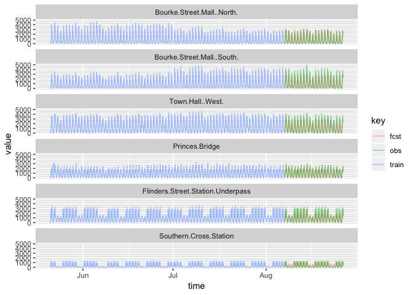

Black Box Methods
================
Logan Wu
1/8/2019

Load data
---------

``` r
# read in a manageable portion of the dataset for now
raw.ts <- fread("data/Pedestrian_volume__updated_monthly_.csv", nrows=50000)
raw.ts[,Date_Time := as.POSIXct(Date_Time, format="%m/%d/%Y %I:%M:%S %p")]
```

Process data
------------

Feature vector includes:

-   n hours of lags
-   Time of day
-   Day of week
-   Sensor name or ID

Could include:

-   Month of year, and year (or some other trend term)
-   Public holiday

``` r
nlag = 3

locs = make.names(unique(raw.ts$Sensor_Name))
data.ts = raw.ts %>%
  dplyr::select(Date_Time, Sensor_Name, Hourly_Counts) %>%
  spread(key=Sensor_Name, value=Hourly_Counts) %>%
  as.xts(frequency=168) %>%
  as.zoo %>%
  na.contiguous %>%# analysis does not include missing data
  as.data.frame %>%
  mutate(time=as.POSIXct(rownames(.)),
         day=factor(weekdays(time)),
         hour=hour(time))
```

    ## Warning: package 'bindrcpp' was built under R version 3.4.4

``` r
names(data.ts) = make.names(names(data.ts))

lags = list()
lags_ix = c(1:nlag, 24, 168)
for (i in seq_along(lags_ix)) {
  lags[[i]] = data.ts %>%
    dplyr::select(-time, -day, -hour) %>%
    mutate_all(function (x) lead(x, lags_ix[i])) %>%
    rename_all(function(x) paste0(x,".lag", lags_ix[i]))
}
lags = do.call(cbind, lags)

# append the lags onto each current measurement
X = list()
for (j in seq_along(locs)) {
  X[[j]] = cbind(Hourly_Counts=data.ts[,locs[j]], 
                 day=data.ts$day, 
                 hour=data.ts$hour, 
                 time=data.ts$time,
                 location=locs[j],
                 lags)
}
X = do.call(rbind, X) %>%
  drop_na() %>%
  arrange(time)
names(X) = make.names(names(X))
X %>% head %>% kable
```

|  Hourly\_Counts| day      |  hour| time       | location                          |  Australia.on.Collins.lag1|  Bourke.Street.Mall..North..lag1|  Bourke.Street.Mall..South..lag1|  Collins.Place..North..lag1|  Collins.Place..South..lag1|  Flagstaff.Station.lag1|  Flinders.Street.Station.Underpass.lag1|  Melbourne.Central.lag1|  New.Quay.lag1|  Princes.Bridge.lag1|  Sandridge.Bridge.lag1|  Southern.Cross.Station.lag1|  State.Library.lag1|  Town.Hall..West..lag1|  Victoria.Point.lag1|  Waterfront.City.lag1|  Webb.Bridge.lag1|  Australia.on.Collins.lag2|  Bourke.Street.Mall..North..lag2|  Bourke.Street.Mall..South..lag2|  Collins.Place..North..lag2|  Collins.Place..South..lag2|  Flagstaff.Station.lag2|  Flinders.Street.Station.Underpass.lag2|  Melbourne.Central.lag2|  New.Quay.lag2|  Princes.Bridge.lag2|  Sandridge.Bridge.lag2|  Southern.Cross.Station.lag2|  State.Library.lag2|  Town.Hall..West..lag2|  Victoria.Point.lag2|  Waterfront.City.lag2|  Webb.Bridge.lag2|  Australia.on.Collins.lag3|  Bourke.Street.Mall..North..lag3|  Bourke.Street.Mall..South..lag3|  Collins.Place..North..lag3|  Collins.Place..South..lag3|  Flagstaff.Station.lag3|  Flinders.Street.Station.Underpass.lag3|  Melbourne.Central.lag3|  New.Quay.lag3|  Princes.Bridge.lag3|  Sandridge.Bridge.lag3|  Southern.Cross.Station.lag3|  State.Library.lag3|  Town.Hall..West..lag3|  Victoria.Point.lag3|  Waterfront.City.lag3|  Webb.Bridge.lag3|  Australia.on.Collins.lag24|  Bourke.Street.Mall..North..lag24|  Bourke.Street.Mall..South..lag24|  Collins.Place..North..lag24|  Collins.Place..South..lag24|  Flagstaff.Station.lag24|  Flinders.Street.Station.Underpass.lag24|  Melbourne.Central.lag24|  New.Quay.lag24|  Princes.Bridge.lag24|  Sandridge.Bridge.lag24|  Southern.Cross.Station.lag24|  State.Library.lag24|  Town.Hall..West..lag24|  Victoria.Point.lag24|  Waterfront.City.lag24|  Webb.Bridge.lag24|  Australia.on.Collins.lag168|  Bourke.Street.Mall..North..lag168|  Bourke.Street.Mall..South..lag168|  Collins.Place..North..lag168|  Collins.Place..South..lag168|  Flagstaff.Station.lag168|  Flinders.Street.Station.Underpass.lag168|  Melbourne.Central.lag168|  New.Quay.lag168|  Princes.Bridge.lag168|  Sandridge.Bridge.lag168|  Southern.Cross.Station.lag168|  State.Library.lag168|  Town.Hall..West..lag168|  Victoria.Point.lag168|  Waterfront.City.lag168|  Webb.Bridge.lag168|
|---------------:|:---------|-----:|:-----------|:----------------------------------|--------------------------:|--------------------------------:|--------------------------------:|---------------------------:|---------------------------:|-----------------------:|---------------------------------------:|-----------------------:|--------------:|--------------------:|----------------------:|----------------------------:|-------------------:|----------------------:|--------------------:|---------------------:|-----------------:|--------------------------:|--------------------------------:|--------------------------------:|---------------------------:|---------------------------:|-----------------------:|---------------------------------------:|-----------------------:|--------------:|--------------------:|----------------------:|----------------------------:|-------------------:|----------------------:|--------------------:|---------------------:|-----------------:|--------------------------:|--------------------------------:|--------------------------------:|---------------------------:|---------------------------:|-----------------------:|---------------------------------------:|-----------------------:|--------------:|--------------------:|----------------------:|----------------------------:|-------------------:|----------------------:|--------------------:|---------------------:|-----------------:|---------------------------:|---------------------------------:|---------------------------------:|----------------------------:|----------------------------:|------------------------:|----------------------------------------:|------------------------:|---------------:|---------------------:|-----------------------:|-----------------------------:|--------------------:|-----------------------:|---------------------:|----------------------:|------------------:|----------------------------:|----------------------------------:|----------------------------------:|-----------------------------:|-----------------------------:|-------------------------:|-----------------------------------------:|-------------------------:|----------------:|----------------------:|------------------------:|------------------------------:|---------------------:|------------------------:|----------------------:|-----------------------:|-------------------:|
|              27| Thursday |     0| 2009-05-21 | Bourke.Street.Mall..North.        |                         10|                               18|                               15|                           8|                          23|                       5|                                      52|                     118|              3|                   29|                     15|                            2|                  73|                     77|                    4|                     1|                 0|                          8|                                7|                                9|                           3|                           9|                       3|                                      30|                      64|              4|                   15|                     12|                            1|                  22|                     37|                    0|                     3|                 3|                          5|                               10|                               18|                           1|                          19|                      18|                                      20|                      32|              5|                   18|                      7|                            5|                   8|                     29|                    2|                     0|                 6|                          37|                                49|                                46|                           20|                           37|                       15|                                      113|                      137|              12|                   110|                      63|                             3|                   87|                     197|                    16|                      7|                  5|                           52|                                 38|                                 44|                             9|                            33|                        14|                                       106|                       123|               12|                     91|                       46|                              5|                    49|                      156|                      6|                       5|                   0|
|              40| Thursday |     0| 2009-05-21 | Bourke.Street.Mall..South.        |                         10|                               18|                               15|                           8|                          23|                       5|                                      52|                     118|              3|                   29|                     15|                            2|                  73|                     77|                    4|                     1|                 0|                          8|                                7|                                9|                           3|                           9|                       3|                                      30|                      64|              4|                   15|                     12|                            1|                  22|                     37|                    0|                     3|                 3|                          5|                               10|                               18|                           1|                          19|                      18|                                      20|                      32|              5|                   18|                      7|                            5|                   8|                     29|                    2|                     0|                 6|                          37|                                49|                                46|                           20|                           37|                       15|                                      113|                      137|              12|                   110|                      63|                             3|                   87|                     197|                    16|                      7|                  5|                           52|                                 38|                                 44|                             9|                            33|                        14|                                       106|                       123|               12|                     91|                       46|                              5|                    49|                      156|                      6|                       5|                   0|
|             136| Thursday |     0| 2009-05-21 | Town.Hall..West.                  |                         10|                               18|                               15|                           8|                          23|                       5|                                      52|                     118|              3|                   29|                     15|                            2|                  73|                     77|                    4|                     1|                 0|                          8|                                7|                                9|                           3|                           9|                       3|                                      30|                      64|              4|                   15|                     12|                            1|                  22|                     37|                    0|                     3|                 3|                          5|                               10|                               18|                           1|                          19|                      18|                                      20|                      32|              5|                   18|                      7|                            5|                   8|                     29|                    2|                     0|                 6|                          37|                                49|                                46|                           20|                           37|                       15|                                      113|                      137|              12|                   110|                      63|                             3|                   87|                     197|                    16|                      7|                  5|                           52|                                 38|                                 44|                             9|                            33|                        14|                                       106|                       123|               12|                     91|                       46|                              5|                    49|                      156|                      6|                       5|                   0|
|             149| Thursday |     0| 2009-05-21 | Princes.Bridge                    |                         10|                               18|                               15|                           8|                          23|                       5|                                      52|                     118|              3|                   29|                     15|                            2|                  73|                     77|                    4|                     1|                 0|                          8|                                7|                                9|                           3|                           9|                       3|                                      30|                      64|              4|                   15|                     12|                            1|                  22|                     37|                    0|                     3|                 3|                          5|                               10|                               18|                           1|                          19|                      18|                                      20|                      32|              5|                   18|                      7|                            5|                   8|                     29|                    2|                     0|                 6|                          37|                                49|                                46|                           20|                           37|                       15|                                      113|                      137|              12|                   110|                      63|                             3|                   87|                     197|                    16|                      7|                  5|                           52|                                 38|                                 44|                             9|                            33|                        14|                                       106|                       123|               12|                     91|                       46|                              5|                    49|                      156|                      6|                       5|                   0|
|             127| Thursday |     0| 2009-05-21 | Flinders.Street.Station.Underpass |                         10|                               18|                               15|                           8|                          23|                       5|                                      52|                     118|              3|                   29|                     15|                            2|                  73|                     77|                    4|                     1|                 0|                          8|                                7|                                9|                           3|                           9|                       3|                                      30|                      64|              4|                   15|                     12|                            1|                  22|                     37|                    0|                     3|                 3|                          5|                               10|                               18|                           1|                          19|                      18|                                      20|                      32|              5|                   18|                      7|                            5|                   8|                     29|                    2|                     0|                 6|                          37|                                49|                                46|                           20|                           37|                       15|                                      113|                      137|              12|                   110|                      63|                             3|                   87|                     197|                    16|                      7|                  5|                           52|                                 38|                                 44|                             9|                            33|                        14|                                       106|                       123|               12|                     91|                       46|                              5|                    49|                      156|                      6|                       5|                   0|
|               4| Thursday |     0| 2009-05-21 | Southern.Cross.Station            |                         10|                               18|                               15|                           8|                          23|                       5|                                      52|                     118|              3|                   29|                     15|                            2|                  73|                     77|                    4|                     1|                 0|                          8|                                7|                                9|                           3|                           9|                       3|                                      30|                      64|              4|                   15|                     12|                            1|                  22|                     37|                    0|                     3|                 3|                          5|                               10|                               18|                           1|                          19|                      18|                                      20|                      32|              5|                   18|                      7|                            5|                   8|                     29|                    2|                     0|                 6|                          37|                                49|                                46|                           20|                           37|                       15|                                      113|                      137|              12|                   110|                      63|                             3|                   87|                     197|                    16|                      7|                  5|                           52|                                 38|                                 44|                             9|                            33|                        14|                                       106|                       123|               12|                     91|                       46|                              5|                    49|                      156|                      6|                       5|                   0|

Test RF on train/test split
---------------------------

``` r
frac = 0.8
X.train = head(X, round(nrow(X)*frac))
X.test = tail(X, round(nrow(X)*(1-frac)))
y.test = X.test %>% pull(Hourly_Counts)
```

Exclude the time and weekday from the model. Purely regressed on lags from the past three hours.

``` r
rf <- ranger(Hourly_Counts ~ . -hour -day -time, num.trees=100, data=X.train)
```

``` r
pred <- predict(rf, X.test)
X.test$pred = pred$predictions
ggplot(X.test, aes(x=Hourly_Counts, y=pred)) +
  geom_point(alpha=0.25)
```


``` r
cat("RMSE", sqrt(mean((X.test$Hourly_Counts-X.test$pred)^2)), "\n")
```

    ## RMSE 429.1817

``` r
cat("MAE", mean(abs(X.test$Hourly_Counts-X.test$pred)))
```

    ## MAE 271.7369

``` r
plt.df.train = X.train %>%
  dplyr::select(time, location, train=Hourly_Counts) %>%
  gather(key="key", value="value", -time, -location)
plt.df.test = X.test %>%
  dplyr::select(time, location, obs=Hourly_Counts, fcst=pred) %>%
  gather(key="key", value="value", -time, -location)
plt.df = rbind(plt.df.train, plt.df.test)

ggplot(plt.df %>% filter(location %in% levels(plt.df$location)[1:6]),
       aes(x=time, y=value, color=key)) +
  geom_line(alpha=0.5) +
  facet_wrap(~location, ncol=1) +
  ylim(0, NA)
```


Introduce time and weekday. Would expect it to improve.

``` r
rf2 <- ranger(Hourly_Counts ~ . -time, num.trees=100, data=X.train)
```

``` r
pred2 <- predict(rf2, X.test)
X.test$pred2 = pred2$predictions
ggplot(X.test, aes(x=Hourly_Counts, y=pred2)) +
  geom_point(alpha=0.25)
```


``` r
cat("RMSE", sqrt(mean((X.test$Hourly_Counts-X.test$pred2)^2)), "\n")
```

    ## RMSE 433.4264

``` r
cat("MAE", mean(abs(X.test$Hourly_Counts-X.test$pred2)))
```

    ## MAE 276.0762

``` r
plt.df.train = X.train %>%
  dplyr::select(time, location, train=Hourly_Counts) %>%
  gather(key="key", value="value", -time, -location)
plt.df.test = X.test %>%
  dplyr::select(time, location, obs=Hourly_Counts, fcst=pred2) %>%
  gather(key="key", value="value", -time, -location)
plt.df = rbind(plt.df.train, plt.df.test)

ggplot(plt.df %>% filter(location %in% levels(plt.df$location)[1:6]),
       aes(x=time, y=value, color=key)) +
  geom_line(alpha=0.5) +
  facet_wrap(~location, ncol=1) +
  ylim(0, NA)
```



Kind of works but systematically underestimates some areas. Comparison required against univariate TS is needed. Also needs to incorporate uncertainty.

Cross-correlation importance
----------------------------

Make separate RFs for each location, and observe the variable importance of cross-correlations.

``` r
Sensor_Names = unique(X$Sensor_Name)
x = list()
rfs = list()
for (s_n in Sensor_Names) {
  x[[s_n]] = X.train %>% filter(Sensor_Name==s_n)
  rfs[[s_n]] = ranger(Hourly_Counts ~ . -Sensor_Name -Date_Time,
                      data=x[[s_n]], importance="permutation")
}
```

``` r
for (s_n in Sensor_Names) {
  g = ggplot(data.frame(importance=importance(rfs[[s_n]])) %>%
           rownames_to_column("variable"),
         aes(x=variable, y=importance, fill=importance)) + 
        geom_bar(stat="identity")+ coord_flip()+
        ylab("Variable Importance")+
        xlab("")+
        ggtitle(paste("Importance for", s_n))+
        guides(fill=F)+
        scale_fill_gradient(low="red", high="blue")
  print(g)
}
```

Permutation feature importance: Determines the marginal impact on performance compared to when one feature is randomised (permuted).

``` r
importance_pvalues(rfs[[1]], "altmann", formula=formula("Hourly_Counts ~ . - Sensor_Name - Date_Time"), data=x[[s_n]], num.permutations=10)
```
