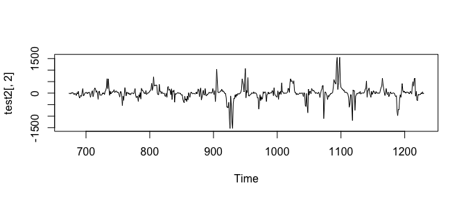
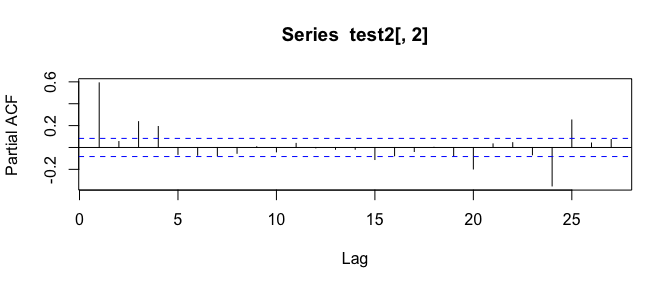
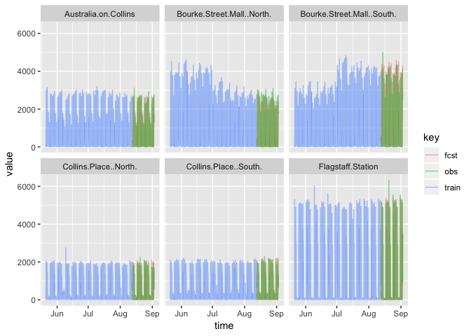

Vector Auto Regression
================
Logan Wu
1/16/2019

Load data
---------

``` r
# read in a manageable portion of the dataset for now
raw.ts <- fread("data/Pedestrian_volume__updated_monthly_.csv", nrows=20000)
raw.ts[,Date_Time := as.POSIXct(Date_Time, format="%m/%d/%Y %I:%M:%S %p")]

raw.geo <- read.csv("data/Pedestrian_sensor_locations.csv")
```

Process TS data
---------------

``` r
data.ts = raw.ts %>%
  select(-ID) %>%
  select(Date_Time, Sensor_Name, Hourly_Counts) %>%
  spread(key=Sensor_Name, value=Hourly_Counts) %>%
  select(-Date_Time) %>%
  as.ts %>%
  na.contiguous # analysis does not include missing data
  # stcenter# %>%
```

Perform differencing
--------------------

Confirm that each sensor series is stationary as we would expect

``` r
for (i in seq_along(colnames(data.ts))) {
  print(ndiffs(data.ts[,i], test="adf"))
}
```

    ## [1] 0
    ## [1] 0
    ## [1] 0
    ## [1] 0
    ## [1] 0
    ## [1] 0
    ## [1] 0
    ## [1] 0
    ## [1] 0
    ## [1] 0
    ## [1] 0
    ## [1] 0
    ## [1] 0
    ## [1] 0
    ## [1] 0
    ## [1] 0
    ## [1] 0

Test to perform seasonal differencing. Weekly differencing only seems to give the best PACF plot.

``` r
test1 = data.ts %>%
  diff(lag=168)
plot(test1[,2])
```


``` r
pacf(test1[,2])
```


``` r
test2 = data.ts %>%
  diff(lag=168) %>%
  diff(lag=24)
plot(test2[,2])
```



``` r
pacf(test2[,2])
```



Split into train/test sets. Later this can turn into a rolling train/test.

``` r
frac = 0.8
X.train = head(test2, round(nrow(test2)*frac))
X.test = tail(test2, round(nrow(test2)*(1-frac)))
```

Perform vector autoregression. Assume the moving average component is not necessary because the series is stationary. [Useful link](https://stats.stackexchange.com/questions/191851/var-forecasting-methodology)

``` r
library(vars)

# lag optimisation
VARselect(test2, lag.max=10, type="both", season=168)
```

    ## $selection
    ## AIC(n)  HQ(n)  SC(n) FPE(n) 
    ##     10      4      1     10 
    ## 
    ## $criteria
    ##                   1            2            3            4            5
    ## AIC(n) 1.762371e+02 1.754222e+02 1.744236e+02 1.730928e+02 1.722979e+02
    ## HQ(n)  1.859486e+02 1.860213e+02 1.859104e+02 1.854672e+02 1.855600e+02
    ## SC(n)  2.010846e+02 2.025407e+02 2.038131e+02 2.047534e+02 2.062295e+02
    ## FPE(n) 5.568634e+76 2.870398e+76 1.272125e+76 4.198364e+75 2.471769e+75
    ##                   6            7            8            9           10
    ## AIC(n) 1.714854e+02 1.709196e+02 1.702803e+02 1.694784e+02 1.688277e+02
    ## HQ(n)  1.856350e+02 1.859568e+02 1.862051e+02 1.862908e+02 1.865278e+02
    ## SC(n)  2.076880e+02 2.093932e+02 2.110249e+02 2.124940e+02 2.141143e+02
    ## FPE(n) 1.501990e+75 1.236383e+75 1.009954e+75 7.570370e+74 7.222566e+74

``` r
myvar = VAR(test2, p=2, season=168)

serial.test(myvar, lags.pt=10, type="PT.asymptotic")
```

    ## 
    ##  Portmanteau Test (asymptotic)
    ## 
    ## data:  Residuals of VAR object myvar
    ## Chi-squared = 5028.1, df = 2312, p-value < 2.2e-16

``` r
arch.test(myvar, lags.multi=10)
```

    ## 
    ##  ARCH (multivariate)
    ## 
    ## data:  Residuals of VAR object myvar
    ## Chi-squared = 83538, df = 234090, p-value = 1

``` r
# summary(myvar)
```

Predictions

``` r
prd <- predict(myvar, n.ahead = 168*2)
fcst = prd$fcst$Webb.Bridge

plt.df1 = data.frame(obs = data.ts[,"Webb Bridge"]) %>%
  mutate(t = as.numeric(rownames(.)))
```

    ## Warning: package 'bindrcpp' was built under R version 3.4.4

``` r
plt.df2 = data.frame(diff = fcst[,1]) %>%
  mutate(t = as.numeric(rownames(.))) %>%
  mutate(t = t + nrow(plt.df1))
plt.df3 = data.frame(fcst = diffinv(fcst[,1], lag=168, xi=tail(data.ts[,"Webb Bridge"], 168))) %>%
  tail(168*2) %>%
  mutate(t = as.numeric(rownames(.))) %>%
  mutate(t = t + min(plt.df2$t) - 168)

plt.df = plt.df1 %>% full_join(plt.df2) %>% full_join(plt.df3) %>%
  gather(key="key", value="value", -t)
```

    ## Joining, by = "t"
    ## Joining, by = "t"

    ## Warning: attributes are not identical across measure variables;
    ## they will be dropped

``` r
ggplot(plt.df, aes(x=t, y=value, color=key)) +
  geom_line()
```

    ## Warning: Removed 1839 rows containing missing values (geom_path).


