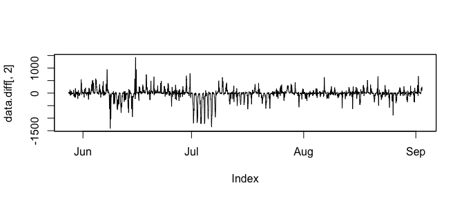
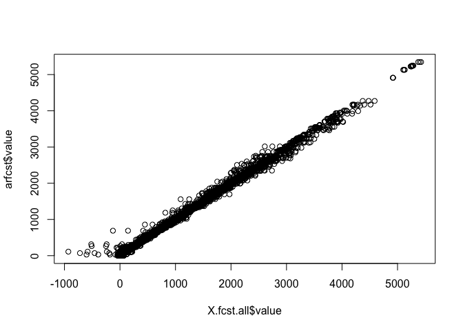

Vector Auto Regression
================
Logan Wu
1/16/2019

Load data
---------

``` r
# read in a manageable portion of the dataset for now
raw.ts <- fread("data/Pedestrian_volume__updated_monthly_.csv", nrows=50000)
raw.ts[,Date_Time := as.POSIXct(Date_Time, format="%m/%d/%Y %I:%M:%S %p")]
```

Process TS data
---------------

``` r
X = raw.ts %>%
  dplyr::select(-ID) %>%
  dplyr::select(Date_Time, Sensor_Name, Hourly_Counts) %>%
  spread(key=Sensor_Name, value=Hourly_Counts) %>%
  as.xts(frequency=168) %>%
  as.zoo %>%
  na.contiguous # analysis does not include missing data
  # stcenter# %>%
names(X) = make.names(names(X))
```

Perform differencing
--------------------

Confirm that each sensor series is stationary as we would expect

``` r
for (i in seq_along(colnames(X))) {
  print(ndiffs(X[,i], test="adf"))
}
```

    ## [1] 0
    ## [1] 0
    ## [1] 0
    ## [1] 0
    ## [1] 0
    ## [1] 0
    ## [1] 0
    ## [1] 0
    ## [1] 0
    ## [1] 0
    ## [1] 0
    ## [1] 0
    ## [1] 0
    ## [1] 0
    ## [1] 0
    ## [1] 0
    ## [1] 0

Test to perform seasonal differencing. Weekly differencing only seems to give the best PACF plot.

``` r
data.diff = X %>%
  diff(lag=168)
plot(data.diff[,2])
```



``` r
pacf(data.diff[,2])
```


Test for cointegration (causality).

``` r
jotest=ca.jo(data.diff[,1:3], type="trace", K=2, ecdet="none", spec="longrun")
summary(jotest)
```

    ## 
    ## ###################### 
    ## # Johansen-Procedure # 
    ## ###################### 
    ## 
    ## Test type: trace statistic , with linear trend 
    ## 
    ## Eigenvalues (lambda):
    ## [1] 0.14460533 0.11435648 0.06690293
    ## 
    ## Values of teststatistic and critical values of test:
    ## 
    ##            test 10pct  5pct  1pct
    ## r <= 2 | 162.31  6.50  8.18 11.65
    ## r <= 1 | 446.97 15.66 17.95 23.52
    ## r = 0  | 813.08 28.71 31.52 37.22
    ## 
    ## Eigenvectors, normalised to first column:
    ## (These are the cointegration relations)
    ## 
    ##                               Australia.on.Collins.l2
    ## Australia.on.Collins.l2                     1.0000000
    ## Bourke.Street.Mall..North..l2              -0.5255953
    ## Bourke.Street.Mall..South..l2              -0.4846191
    ##                               Bourke.Street.Mall..North..l2
    ## Australia.on.Collins.l2                           1.0000000
    ## Bourke.Street.Mall..North..l2                     0.2126367
    ## Bourke.Street.Mall..South..l2                     0.1486375
    ##                               Bourke.Street.Mall..South..l2
    ## Australia.on.Collins.l2                             1.00000
    ## Bourke.Street.Mall..North..l2                     -17.43181
    ## Bourke.Street.Mall..South..l2                      18.42751
    ## 
    ## Weights W:
    ## (This is the loading matrix)
    ## 
    ##                              Australia.on.Collins.l2
    ## Australia.on.Collins.d                    -0.0783956
    ## Bourke.Street.Mall..North..d               0.3151664
    ## Bourke.Street.Mall..South..d               0.2847123
    ##                              Bourke.Street.Mall..North..l2
    ## Australia.on.Collins.d                          -0.2121899
    ## Bourke.Street.Mall..North..d                    -0.1699760
    ## Bourke.Street.Mall..South..d                    -0.1619121
    ##                              Bourke.Street.Mall..South..l2
    ## Australia.on.Collins.d                        0.0001602198
    ## Bourke.Street.Mall..North..d                  0.0037680025
    ## Bourke.Street.Mall..South..d                 -0.0051508124

Above is an example of the Johansen co-integration test, using just three series instead of the entire matrix. The *r* test statistics reject the null hypothesis that the series are not co-integrated.

Split into train/test sets. Later this can turn into a rolling train/test.

``` r
frac = 0.8
X.train = head(X, round(nrow(X)*frac))
X.test = tail(X, round(nrow(X)*(1-frac)))
plot(X.train)
title("Original series")
```


``` r
X.train.diff = X.train %>%
  diff(lag=168)
plot(X.train.diff)
title("Seasonally differenced series")
```


Perform vector autoregression. Assume the moving average component is not necessary because the series is stationary. [Useful link](https://stats.stackexchange.com/questions/191851/var-forecasting-methodology)

``` r
# lag optimisation
VARselect(X.train.diff, lag.max=10, type="both", season=168)
```

    ## $selection
    ## AIC(n)  HQ(n)  SC(n) FPE(n) 
    ##      6      4      1      6 
    ## 
    ## $criteria
    ##                   1            2            3            4            5
    ## AIC(n) 1.569864e+02 1.566241e+02 1.562818e+02 1.558989e+02 1.558804e+02
    ## HQ(n)  1.604942e+02 1.604525e+02 1.604308e+02 1.603685e+02 1.606706e+02
    ## SC(n)  1.664977e+02 1.670048e+02 1.675318e+02 1.680183e+02 1.688690e+02
    ## FPE(n) 1.525742e+68 1.065908e+68 7.601445e+67 5.209422e+67 5.143210e+67
    ##                   6            7            8            9           10
    ## AIC(n) 1.558636e+02 1.559126e+02 1.559891e+02 1.560980e+02 1.562043e+02
    ## HQ(n)  1.609745e+02 1.613440e+02 1.617411e+02 1.621707e+02 1.625976e+02
    ## SC(n)  1.697216e+02 1.706399e+02 1.715857e+02 1.725640e+02 1.735396e+02
    ## FPE(n) 5.091426e+67 5.387185e+67 5.864756e+67 6.602483e+67 7.421097e+67

``` r
myvar = VAR(X.train.diff, p=2, season=168)

serial.test(myvar, lags.pt=10, type="PT.asymptotic")
```

    ## 
    ##  Portmanteau Test (asymptotic)
    ## 
    ## data:  Residuals of VAR object myvar
    ## Chi-squared = 4836.2, df = 2312, p-value < 2.2e-16

``` r
# arch.test(myvar, lags.multi=10)
# summary(myvar)
```

Predictions

``` r
prd <- predict(myvar, n.ahead = nrow(X.test))
```

``` r
# fcst = diffinv(prd$fcst$Webb.Bridge[,1], lag=168, xi=tail(X.train[,"Webb.Bridge"], 168)) %>%
#   tail(nrow(X.test))
fcst.all = lapply(prd$fcst,
                  function(X) X[,"fcst"]
  )
fcst.all = sapply(names(prd$fcst), function(N) diffinv(fcst.all[[N]],
                                                       lag=168,
                                                       xi=tail(X.train[,N], 168)
                                                       )
                  ) %>%
  as.data.frame %>%
  tail(nrow(X.test)) %>%
  mutate(time = index(X.test)) %>%
  gather(key="location", value="value", -time)
  
X.train.all = X.train %>%
  as.data.frame %>%
  mutate(time = as.POSIXct(rownames(.)),
         key="train") %>%
  gather(key="location", value="value", -time, -key)
X.obs.all = X.test %>%
  as.data.frame %>%
  mutate(time = as.POSIXct(rownames(.)),
         key="obs") %>%
  gather(key="location", value="value", -time, -key)
X.fcst.all = fcst.all %>%
  mutate(key="fcst.var")
X.all = X.train.all %>% rbind(X.obs.all) %>% rbind(X.fcst.all) %>%
  mutate(key=factor(key), location=factor(location)) %>%
  arrange(time)

ggplot(X.all %>% filter(location %in% levels(X.all$location)[1:6]),
       aes(x=time, y=value, color=key)) +
  geom_line(alpha=0.5) +
  facet_wrap(~location, ncol=1) +
  ylim(0, NA)
```


Error quantification

``` r
MAE = X.obs.all %>%
  full_join(X.fcst.all, by=c("time", "location"), suffix=c(".obs", ".fcst")) %>%
  dplyr::select(time, location, value.obs, value.fcst) %>%
  mutate(AE = abs(value.obs-value.fcst)) %>%
  pull(AE) %>%
  mean
MAE
```

    ## [1] 81.41797

Comparison with multiple univariate time series
-----------------------------------------------

``` r
myars = lapply(X.train.diff, function(ts) arima(ts, order=c(1,0,0), include.mean=F))

arfcst = sapply(myars, predict, n.ahead=nrow(X.test), se.fit=F) %>%
  as.data.frame
arfcst = sapply(names(arfcst), function(N) diffinv(arfcst[,N],
                                                       lag=168,
                                                       xi=tail(X.train[,N], 168)
                                                       )
                ) %>%
  as.data.frame %>%
  tail(nrow(X.test)) %>%
  mutate(time = index(X.test), key="fcst.ar") %>%
  gather(key="location", value="value", -time, -key)

plot(X.fcst.all$value, arfcst$value)
```



Unlike a univariate AR(1) model, this particular VAR prediction contains negative values.

``` r
X.all = X.train.all %>% rbind(X.obs.all) %>% rbind(arfcst) %>%
  mutate(key=factor(key), location=factor(location)) %>%
  arrange(time)
ggplot(X.all %>% filter(location %in% levels(X.all$location)[1:6]),
       aes(x=time, y=value, color=key)) +
  geom_line(alpha=0.5) +
  facet_wrap(~location, ncol=1) +
  ylim(0, NA)
```


``` r
MAE = X.obs.all %>%
  full_join(arfcst, by=c("time", "location"), suffix=c(".obs", ".fcst")) %>%
  dplyr::select(time, location, value.obs, value.fcst) %>%
  mutate(AE = abs(value.obs-value.fcst)) %>%
  pull(AE) %>%
  mean()
MAE
```

    ## [1] 70.10214
